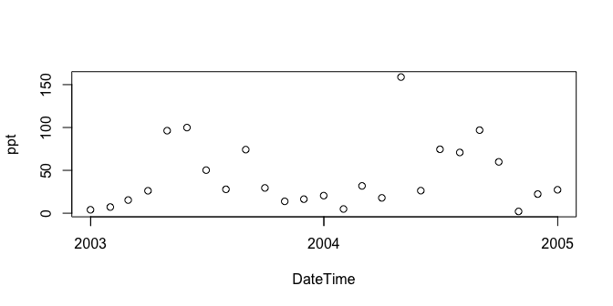

`geoknife` package version 1.4.0
================================

[](https://ci.appveyor.com/project/jread-usgs/geoknife/branch/master) [](https://travis-ci.org/USGS-R/geoknife) [](https://coveralls.io/r/USGS-R/geoknife) [](https://cran.r-project.org/package=geoknife)
Tools for geo-web processing of gridded data via the [Geo Data Portal](http://cida.usgs.gov/gdp/ "Geo Data Portal"). `geoknife` slices up gridded data according to overlap with irregular features, such as watersheds, lakes, points, etc. The result is subsetted data in plain text, NetCDF, geotiff or other formats.
<p align="center">

</p>
### Installing `geoknife`

To install the `geoknife` from CRAN:

``` r
install.packages("geoknife")
```

To install the stable version of `geoknife` package with dependencies:

``` r
install.packages("geoknife", 
    repos = c("http://owi.usgs.gov/R","http://cran.rstudio.com/"),
    dependencies = TRUE)
```

Or to install the current development version of the package:

``` r
install.packages("devtools")
devtools::install_github('USGS-R/geoknife')
```

### `geoknife` overview

The `geoknife` package was created to support web-based geoprocessing of large gridded datasets according to their overlap with landscape (or aquatic/ocean) features that are often irregularly shaped. `geoknife` creates data access and subsequent geoprocessing requests for the USGS's Geo Data Portal to carry out on a web server. The results of these requests are available for download after the processes have been completed. This type of workflow has three main advantages: 1) it allows the user to avoid downloading large datasets, 2) it avoids reinventing the wheel for the creation and optimization of complex geoprocessing algorithms, and 3) computing resources are dedicated elsewhere, so `geoknife` operations do not have much of an impact on a local computer.

`geoknife` interacts with a remote server to figure out what types of processing capabilities are available, in addition to seeing what types of geospatial features are already available to be used as an area of interest (commonly, these are user-uploaded shapefiles). Because communication with web resources are central to `geoknife` operations, users must have an active internet connection.

The main elements of setting up and carrying out a `geoknife` 'job' (`geojob`) include defining the feature of interest (the `stencil` argument in the `geoknife` function), the gridded web dataset to be processed (the `fabric` argument in the `geoknife` function), and the the processing algorithm parameters (the `knife` argument in the `geoknife` function). The status of the `geojob` can be checked with `check`, and output can be loaded into a data.frame with `result`.

### What can `geoknife` do?

##### define a stencil that represents the geographic region to slice out of the data

``` r
library(geoknife)
# from a single point
stencil <- simplegeom(c(-89, 46.23))
   # -- or --
# from a collection of named points
stencil <- simplegeom(data.frame(
              'point1' = c(-89, 46), 
              'point2' = c(-88.6, 45.2)))
   # -- or --
#for a state from a web available dataset
stencil <- webgeom('state::New Hampshire')
stencil <- webgeom('state::New Hampshire,Wisconsin,Alabama')
   # -- or --
#for HUC8s from a web available dataset
stencil <- webgeom('HUC8::09020306,14060009')
```

##### define a fabric that represents the underlying data

``` r
# from the prism dataset:
fabric <- webdata('prism')
   # -- or --
# explicitly define webdata from a list:
fabric <- webdata(list(
            times = as.POSIXct(c('1895-01-01','1899-01-01')),
            url = 'https://cida.usgs.gov/thredds/dodsC/prism_v2',
            variables = 'ppt'))
# modify the times field:
times(fabric) <- as.POSIXct(c('2003-01-01','2005-01-01'))
```

##### create the processing job that will carry out the subsetting/summarization task

``` r
job <- geoknife(stencil, fabric, wait = TRUE)

# use existing convienence functions to check on the job:
check(job)
```

    ## $status
    ## [1] "Process successful"
    ## 
    ## $URL
    ## [1] "http://cida.usgs.gov:80/gdp/process/RetrieveResultServlet?id=04506476-c04d-4eeb-801e-fd4f981fbeddOUTPUT"
    ## 
    ## $statusType
    ## [1] "ProcessSucceeded"

see also:

``` r
running(job)
error(job)
successful(job)
```

##### plot the results

``` r
data <- result(job)
plot(data[,1:2], ylab = variables(fabric))
```



##### use an email to listen for process completion

``` r
job <- geoknife(webgeom('state::New Hampshire'), fabric = 'prism', email = 'fake.email@gmail.com')
```

### `geoknife` Functions (as of v1.1.5)

<table style="width:40%;">
<colgroup>
<col width="19%" />
<col width="20%" />
</colgroup>
<thead>
<tr class="header">
<th align="left">Function</th>
<th align="left">Title</th>
</tr>
</thead>
<tbody>
<tr class="odd">
<td align="left"><code>geoknife</code></td>
<td align="left">slice up gridded data according to overlap with feature(s)</td>
</tr>
<tr class="even">
<td align="left"><code>gconfig</code></td>
<td align="left">set or query package settings for <code>geoknife</code> processing defaults</td>
</tr>
<tr class="odd">
<td align="left"><code>algorithm</code></td>
<td align="left">the algorithm of a <code>webprocess</code></td>
</tr>
<tr class="even">
<td align="left"><code>attribute</code></td>
<td align="left">the attribute of an <code>webgeom</code></td>
</tr>
<tr class="odd">
<td align="left"><code>check</code></td>
<td align="left">check status of <code>geojob</code></td>
</tr>
<tr class="even">
<td align="left"><code>download</code></td>
<td align="left">download the results of a <code>geojob</code></td>
</tr>
<tr class="odd">
<td align="left"><code>error</code></td>
<td align="left">convenience function for state of <code>geojob</code></td>
</tr>
<tr class="even">
<td align="left"><code>running</code></td>
<td align="left">convenience function for state of <code>geojob</code></td>
</tr>
<tr class="odd">
<td align="left"><code>successful</code></td>
<td align="left">convenience function for state of <code>geojob</code></td>
</tr>
<tr class="even">
<td align="left"><code>start</code></td>
<td align="left">start a <code>geojob</code></td>
</tr>
<tr class="odd">
<td align="left"><code>cancel</code></td>
<td align="left">cancel a <code>geojob</code></td>
</tr>
<tr class="even">
<td align="left"><code>geom</code></td>
<td align="left">the geom of a <code>webgeom</code></td>
</tr>
<tr class="odd">
<td align="left"><code>inputs</code></td>
<td align="left">the inputs of a <code>webprocess</code></td>
</tr>
<tr class="even">
<td align="left"><code>id</code></td>
<td align="left">the process id of a <code>geojob</code></td>
</tr>
<tr class="odd">
<td align="left"><code>values</code></td>
<td align="left">the values of a <code>webgeom</code></td>
</tr>
<tr class="even">
<td align="left"><code>result</code></td>
<td align="left">load the output of a completed <code>geojob</code> into data.frame</td>
</tr>
<tr class="odd">
<td align="left"><code>variables</code></td>
<td align="left">the variables for a <code>webdata</code> object</td>
</tr>
<tr class="even">
<td align="left"><code>wait</code></td>
<td align="left">wait for a <code>geojob</code> to complete processing</td>
</tr>
<tr class="odd">
<td align="left"><code>times</code></td>
<td align="left">the times of a <code>webdata</code> object</td>
</tr>
<tr class="even">
<td align="left"><code>url</code></td>
<td align="left">the url of a <code>webdata</code>, <code>webgeom</code>, <code>geojob</code>, or <code>webprocess</code></td>
</tr>
<tr class="odd">
<td align="left"><code>version</code></td>
<td align="left">the version of a <code>webgeom</code> or <code>webdata</code></td>
</tr>
<tr class="even">
<td align="left"><code>xml</code></td>
<td align="left">the xml of a <code>geojob</code></td>
</tr>
<tr class="odd">
<td align="left"><code>query</code></td>
<td align="left">query datasets or variables</td>
</tr>
</tbody>
</table>

### `geoknife` classes (as of v0.12.0)

<table style="width:40%;">
<colgroup>
<col width="19%" />
<col width="20%" />
</colgroup>
<thead>
<tr class="header">
<th align="left">Class</th>
<th align="left">Title</th>
</tr>
</thead>
<tbody>
<tr class="odd">
<td align="left"><code>simplegeom</code></td>
<td align="left">a simple geometric class. Extends <code>sp::SpatialPolygons</code></td>
</tr>
<tr class="even">
<td align="left"><code>webgeom</code></td>
<td align="left">a web feature service geometry</td>
</tr>
<tr class="odd">
<td align="left"><code>webprocess</code></td>
<td align="left">a web processing service</td>
</tr>
<tr class="even">
<td align="left"><code>webdata</code></td>
<td align="left">web data</td>
</tr>
<tr class="odd">
<td align="left"><code>geojob</code></td>
<td align="left">a geo data portal processing job</td>
</tr>
<tr class="even">
<td align="left"><code>datagroup</code></td>
<td align="left">a simple class that contains data lists that can be <code>webdata</code></td>
</tr>
</tbody>
</table>

What libraries does `geoknife` need?
------------------------------------

This version requires `httr`, `sp`, and `XML`. All of these packages are available on CRAN, and will be installed automatically when using the `install.packages()` instructions above.

Disclaimer
----------

This software is in the public domain because it contains materials that originally came from the U.S. Geological Survey, an agency of the United States Department of Interior. For more information, see the [official USGS copyright policy](https://www2.usgs.gov/visual-id/credit_usgs.html#copyright/ "official USGS copyright policy")

Although this software program has been used by the U.S. Geological Survey (USGS), no warranty, expressed or implied, is made by the USGS or the U.S. Government as to the accuracy and functioning of the program and related program material nor shall the fact of distribution constitute any such warranty, and no responsibility is assumed by the USGS in connection therewith.

This software is provided "AS IS."
