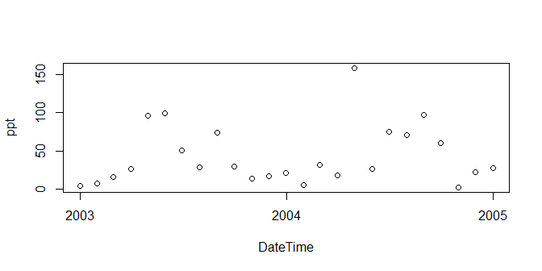

# `geoknife` package version 1.6.6

[](https://ci.appveyor.com/project/jread-usgs/geoknife/branch/master)
[](https://travis-ci.org/USGS-R/geoknife)
[](https://coveralls.io/github/USGS-R/geoknife?branch=master)
[](https://cran.r-project.org/package=geoknife)  
[](https://owi.usgs.gov/R/packages.html#core)
Tools for geo-web processing of gridded data via the [Geo Data
Portal](https://cida.usgs.gov/gdp/ "Geo Data Portal"). `geoknife` slices
up gridded data according to overlap with irregular features, such as
watersheds, lakes, points, etc. The result is subsetted data in plain
text, NetCDF, geotiff or other formats.
<p align="center">

</p>

<br />

### Installing `geoknife`

To install the `geoknife` from CRAN:

``` r
install.packages("geoknife")
```

Or to install the current development version of the package:

``` r
install.packages("remotes")
remotes::install_github('USGS-R/geoknife')
```

### Reporting bugs

Please consider reporting bugs and asking questions on the Issues page:
<https://github.com/USGS-R/geoknife/issues>

Follow `@USGS_R` on Twitter for updates on USGS R packages:

[](https://twitter.com/USGS_R)

### Code of Conduct

We want to encourage a warm, welcoming, and safe environment for
contributing to this project. See the [code of
conduct](https://github.com/USGS-R/geoknife/blob/master/CONDUCT.md) for
more information.

### Package Support

The Water Mission Area of the USGS supports the development and
maintenance of `geoknife` through September 2018, and most likely
further into the future. Resources are available primarily for
maintenance and responding to user questions. Priorities on the
development of new features are determined by the `geoknife` development
team.

[](https://www.usgs.gov/)

## `geoknife` overview

The `geoknife` package was created to support web-based geoprocessing of
large gridded datasets according to their overlap with landscape (or
aquatic/ocean) features that are often irregularly shaped. `geoknife`
creates data access and subsequent geoprocessing requests for the USGS’s
Geo Data Portal to carry out on a web server. The results of these
requests are available for download after the processes have been
completed. This type of workflow has three main advantages: 1) it allows
the user to avoid downloading large datasets, 2) it avoids reinventing
the wheel for the creation and optimization of complex geoprocessing
algorithms, and 3) computing resources are dedicated elsewhere, so
`geoknife` operations do not have much of an impact on a local computer.

`geoknife` interacts with a remote server to figure out what types of
processing capabilities are available, in addition to seeing what types
of geospatial features are already available to be used as an area of
interest (commonly, these are user-uploaded shapefiles). Because
communication with web resources are central to `geoknife` operations,
users must have an active internet connection.

The main elements of setting up and carrying out a `geoknife` ‘job’
(`geojob`) include defining the feature of interest (the `stencil`
argument in the `geoknife` function), the gridded web dataset to be
processed (the `fabric` argument in the `geoknife` function), and the
the processing algorithm parameters (the `knife` argument in the
`geoknife` function). The status of the `geojob` can be checked with
`check`, and output can be loaded into a data.frame with `result`.

### What can `geoknife` do?

##### Define a stencil that represents the geographic region to slice out of the data

``` r
library(geoknife)
# from a single point
stencil <- simplegeom(c(-89, 46.23))
   # -- or --
# from a collection of named points
stencil <- simplegeom(data.frame(
              'point1' = c(-89, 46), 
              'point2' = c(-88.6, 45.2)))
   # -- or --
#for a state from a web available dataset
stencil <- webgeom('state::New Hampshire')
stencil <- webgeom('state::New Hampshire,Wisconsin,Alabama')
   # -- or --
#for HUC8s from a web available dataset
stencil <- webgeom('HUC8::09020306,14060009')
```

##### Define a fabric that represents the underlying data

``` r
# from the prism dataset:
fabric <- webdata('prism')
   # -- or --
# explicitly define webdata from a list:
fabric <- webdata(list(
            times = as.POSIXct(c('1895-01-01','1899-01-01')),
            url = 'https://cida.usgs.gov/thredds/dodsC/prism_v2',
            variables = 'ppt'))
# modify the times field:
times(fabric) <- as.POSIXct(c('2003-01-01','2005-01-01'))
```

##### Create the processing job that will carry out the subsetting/summarization task

``` r
job <- geoknife(stencil, fabric, wait = TRUE)
```

    ## Process Accepted

``` r
# use existing convienence functions to check on the job:
check(job)
```

    ## $status
    ## [1] "Process successful"
    ## 
    ## $URL
    ## [1] "https://cida.usgs.gov:443/gdp/process/RetrieveResultServlet?id=45218971-3739-468c-aaae-60bf8607386cOUTPUT"
    ## 
    ## $statusType
    ## [1] "ProcessSucceeded"
    ## 
    ## $percentComplete
    ## [1] "100"

see also:

``` r
running(job)
error(job)
successful(job)
```

##### Plot the results

``` r
data <- result(job)
plot(data[,1:2], ylab = variables(fabric))
```



##### Use an email to listen for process completion

``` r
job <- geoknife(webgeom('state::New Hampshire'), fabric = 'prism', email = 'fake.email@gmail.com')
```

### `geoknife` Functions (as of v1.1.5)

| Function     | Title                                                            |
|--------------|:-----------------------------------------------------------------|
| `geoknife`   | slice up gridded data according to overlap with feature(s)       |
| `gconfig`    | set or query package settings for `geoknife` processing defaults |
| `algorithm`  | the algorithm of a `webprocess`                                  |
| `attribute`  | the attribute of an `webgeom`                                    |
| `check`      | check status of `geojob`                                         |
| `download`   | download the results of a `geojob`                               |
| `error`      | convenience function for state of `geojob`                       |
| `running`    | convenience function for state of `geojob`                       |
| `successful` | convenience function for state of `geojob`                       |
| `start`      | start a `geojob`                                                 |
| `cancel`     | cancel a `geojob`                                                |
| `geom`       | the geom of a `webgeom`                                          |
| `inputs`     | the inputs of a `webprocess`                                     |
| `id`         | the process id of a `geojob`                                     |
| `values`     | the values of a `webgeom`                                        |
| `result`     | load the output of a completed `geojob` into data.frame          |
| `variables`  | the variables for a `webdata` object                             |
| `wait`       | wait for a `geojob` to complete processing                       |
| `times`      | the times of a `webdata` object                                  |
| `url`        | the url of a `webdata`, `webgeom`, `geojob`, or `webprocess`     |
| `version`    | the version of a `webgeom` or `webdata`                          |
| `xml`        | the xml of a `geojob`                                            |
| `query`      | query datasets or variables                                      |

### `geoknife` classes (as of v0.12.0)

| Class        | Title                                                         |
|--------------|:--------------------------------------------------------------|
| `simplegeom` | a simple geometric class. Extends `sp::SpatialPolygons`       |
| `webgeom`    | a web feature service geometry                                |
| `webprocess` | a web processing service                                      |
| `webdata`    | web data                                                      |
| `geojob`     | a geo data portal processing job                              |
| `datagroup`  | a simple class that contains data lists that can be `webdata` |

## What libraries does `geoknife` need?

This version requires `httr`, `sp`, and `XML`. All of these packages are
available on CRAN, and will be installed automatically when using the
`install.packages()` instructions above.

## Check Notes:

In addition to typical R package checking, a Dockerfile is included in
this repository. Once built, it can be run with the following command.

    docker build -t geoknife_test .

    docker run --rm -it -v %cd%:/src geoknife_test /bin/bash -c "cp -r /src/* /check/ && cp /src/.Rbuildignore /check/ && cd /check && Rscript -e 'devtools::build()' && R CMD check --as-cran ../geoknife_*"

## Disclaimer

This software is in the public domain because it contains materials that
originally came from the U.S. Geological Survey, an agency of the United
States Department of Interior. For more information, see the [official
USGS copyright
policy](https://www2.usgs.gov/visual-id/credit_usgs.html#copyright/ "official USGS copyright policy")

Although this software program has been used by the U.S. Geological
Survey (USGS), no warranty, expressed or implied, is made by the USGS or
the U.S. Government as to the accuracy and functioning of the program
and related program material nor shall the fact of distribution
constitute any such warranty, and no responsibility is assumed by the
USGS in connection therewith.

This software is provided “AS IS.”
